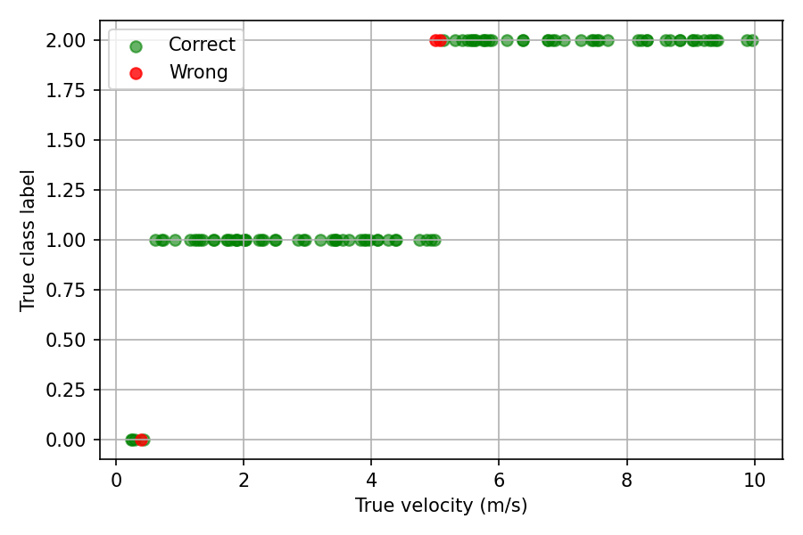
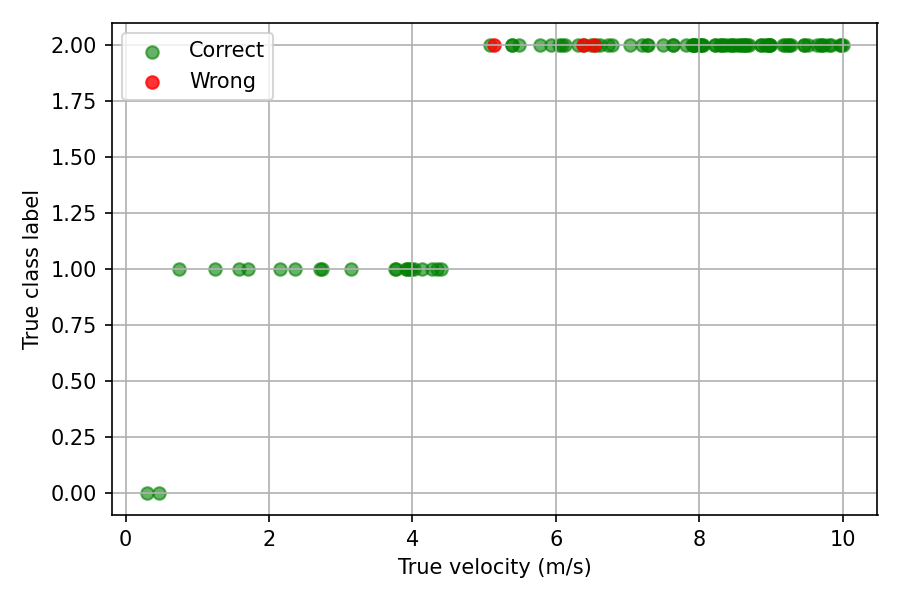

Inductive Bias and Label Ambiguity in Range–Doppler Classification
A CNN vs ViT Study
________________________________________
1. Motivation
Automotive radar ML pipelines often rely on deep learning models trained on Range–Doppler (RD) maps. This project investigates what these models actually learn, and where they fail, under simplified velocity-based labeling.
The focus is not achieving state-of-the-art accuracy, but understanding:
•	inductive bias,
•	model behavior under ambiguity,
•	why scene-level classification breaks down in multi-target radar data.
________________________________________
2. Dataset and Problem Formulation
•	RD maps are generated via 2D FFT of beat (IF) signals following FMCW radar principles
•	Complex noise is added prior to FFT to emulate realistic radar measurements
•	Two scenarios are analyzed:
o	Single-target scenes
o	Multi-target scenes
•	Each RD map is assigned one class label, even in multi-target cases, to study the limitations of single-label supervision
________________________________________
3. Phase 1: CNN-Based RD Map Classification
What the CNN Learns
The CNN does not estimate velocity explicitly.
Instead, it learns scene-level Doppler energy patterns, including:
•	spatial distribution of energy
•	dominant Doppler structures
•	smearing effects due to noise and interference
________________________________________
Results & Insights
Single-target scenes
•	One dominant Doppler peak
•	Clear correspondence between velocity and RD structure
•	Errors occur primarily at velocity decision boundaries
Interpretation:
Performance is limited by radar resolution and noise.
________________________________________
Multi-target scenes
•	Multiple Doppler peaks coexist
•	Energy dominance does not necessarily correspond to the fastest target
•	Classification errors occur away from velocity boundaries
Interpretation:
Errors arise from a mismatch between scene-level CNN perception and target-level labeling.
Although labels are defined by the maximum target velocity, the CNN operates on the global RD energy pattern. When a slower target dominates the Doppler energy, the RD map resembles a pedestrian-like scene, leading the CNN to predict “pedestrian” while the label indicates “vehicle”.
These errors reflect ambiguous supervision, not insufficient model capacity.
________________________________________
Velocity vs Label Example
Single target example:

Multi target example

________________________________________
4. Phase 2: CNN vs Vision Transformer (ViT)
4.1 Why Introduce ViT?
CNNs have strong locality bias. ViTs offer:
•	global attention
•	long-range interactions
•	weaker inductive bias
Goal:
To study the difference in performance due to the architectural differences between ViT and CNN.
________________________________________
4.2 Vision Transformer Architecture (Radar Interpretation)
Step 1: Flatten RD map
•	Each RD map has a dimension of 64 × 64
•	Each map is divided into 16 patches, each patch has a dimension of 16 × 16
•	Flatten each patch into a vector of length 256
•	Result: 16 vectors of length 256 go to the linear projection block (Step 2)
Radar interpretation:
Each patch corresponds to a localized region in range–Doppler space, covering a group of range bins and Doppler bins. Patchification therefore preserves local energy patterns (e.g., Doppler peaks, smearing due to noise or multiple targets) while allowing the model to reason globally across the scene in later attention layers.
________________________________________
Step 2: Linear Projection
•	Model uses vit_tiny_patch16_224, where D = 192
•	Each vector is multiplied by a weight matrix of dimension (256 × 192)
•	Result: 16 vectors, each of length 192
________________________________________
Step 3: Positional Embedding
•	Add the associated positional embedding vector of length D (192) to every vector
•	Result: 16 position-aware vectors, each of length 192
Radar interpretation:
Positional embeddings encode the spatial location of each range–Doppler patch, ensuring that a Doppler peak at high velocity and short range is distinguishable from an identical pattern at low velocity or long range.
________________________________________
Step 4: CLS Token
•	Special learnable token for classification added at the beginning
•	Result: 17 tokens, each of length 192 (17 × 192)
Radar interpretation:
The CLS token represents a scene-level summary of the entire RD map, analogous to aggregating information across all detected range–Doppler regions for scene classification.
________________________________________
Step 5: Encoder
•	All tokens go through N sequential Encoder blocks
•	N = 12 for the used vit_tiny_patch16_224 model
Step 5a: Multi-head Self-Attention
•	D is split across heads (3 heads)
•	192 / 3 = 64 per head
Q, K, V computation:
•	Query (Q): token × W_q → 64-dim
•	Key (K): token × W_k → 64-dim
•	Value (V): token × W_v → 64-dim
Attention:
•	Score = Qᵢ · Kⱼ
•	Softmax produces attention weights
•	All tokens attend to all others (no masking)
Output:
•	Weighted sum over Value vectors → 17 × 64 per head
•	Concatenate heads → 17 × 192
Radar interpretation:
This enables interactions between distant range–Doppler regions, allowing the model to relate multiple Doppler peaks or distributed energy patterns in multi-target or noisy scenes.
Residual Connection + Layer Norm
•	Output + input
•	Layer normalization
•	Result: 17 × 192
________________________________________
Step 5b: Feed Forward Network
•	Linear: 192 → 768
•	GELU activation
•	Linear: 768 → 192
•	Residual connection + Layer Norm
•	Result: 17 × 192
Radar interpretation:
The feed-forward network refines each token’s representation after global context has been incorporated, acting as a nonlinear feature transformation rather than performing spatial aggregation.
Step 5 repeats 12 times.
________________________________________
Step 6: Classification
•	Input: CLS token (1 × 192)
•	Linear: 192 → 3
•	Softmax produces class probabilities
Radar interpretation:
The final classification reflects a global interpretation of the RD map rather than explicit detection or classification of individual targets.
________________________________________
4.3 Experimental Comparisons
Table1: Accuracy vs No of Samples (Dataset size)	
No of samples	CNN Accuracy (%)	ViT Accuracy (%)
200	97.5	52.5
500	99	93
1000	99.5	99.5

Table 2: Accuracy vs No of Targets (averaged for 5 iterations)
No of Targets	CNN Accuracy (%)	ViT Accuracy (%)
2	89.5	78.5
4	95	95
6	97	97.5
8	97.5	97.5

Analysis:
•	ViT underperforms in simple scenes because global attention has limited benefit when few targets are present, and the scene lacks meaningful global structure
•	CNN excels in low-complexity scenes due to strong locality bias that aligns well with the physical structure of Range–Doppler maps
•	As target count increases, global structure becomes more informative, allowing ViT to match CNN performance
•	At high target densities, both models saturate due to a mismatch between scene-level inputs and target-level velocity-based labeling. Both models minimize classification loss primarily based on energy/magnitude patterns in the RD maps and do not explicitly enforce Doppler position or velocity awareness. This saturation therefore reflects label ambiguity rather than architectural limitations. In practice, this is addressed using position-aware losses, multi-task learning, or target-level supervision
________________________________________
5. Key Takeaways
•	RD map classification models learn energy patterns, not explicit velocity reasoning
•	Global attention helps only when global structure exists
•	Label design and loss formulation dominate performance in multi-target radar scenes
•	Scene-level classification is fundamentally limited for multi-target radar perception
________________________________________
